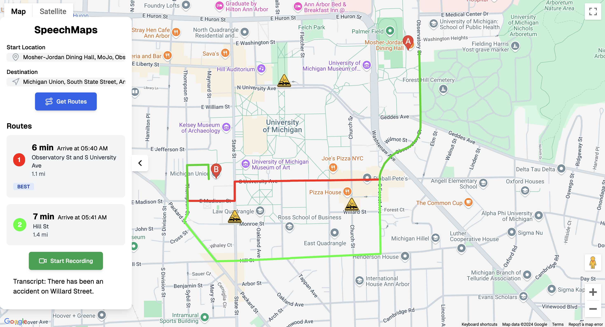

  

<h1 align="center">
  SpeechMaps.io
</h1>

  
  
  

SpeechMaps is an innovative navigation solution that optimizes your travel routes by dynamically reconfiguring them with AI based on real-time traffic incidents. Unlike conventional GPS applications that may not promptly update route conditions, SpeechMaps allows users to report accidents directly through voice input, ensuring immediate updates to avoid congested or blocked areas and uploading the incident for all users to see who are connected to the SpeechMaps network.

## ⭐ Features
- ⚡️ Next.js 14 with App Router
- 🛜 Server and Client Side Rendering
- 🛡 Strict TypeScript and ESLint configuration
- 📱 Fully Responsive
- 🎨 Tailwind CSS - for modern styling
- 🃏 Aceternity UI - accessible UI components
- 🎨 Animation - using Framer Motion
- 🗣️ Speech recognition with Groq AI
- 📍 Smart map integration with Google Maps API
- 🖇️ Deployed with Vercel

## ✍🏻 Author

- [@jere67](https://github.com/jere67)
- [@nickqchoi](https://github.com/nickqchoi)

## 🪪 License

Please do not deploy this directly to production. It is not a template and is not intended to be used as one.

This project is open source and available under the [GPL3 License](LICENSE).

## 🤖 Improvements and Changes to Make
- Develop into mobile app
- Implement Augmented Reality for route visualization
- Cleaner code base
- Automatic vehicle tracking